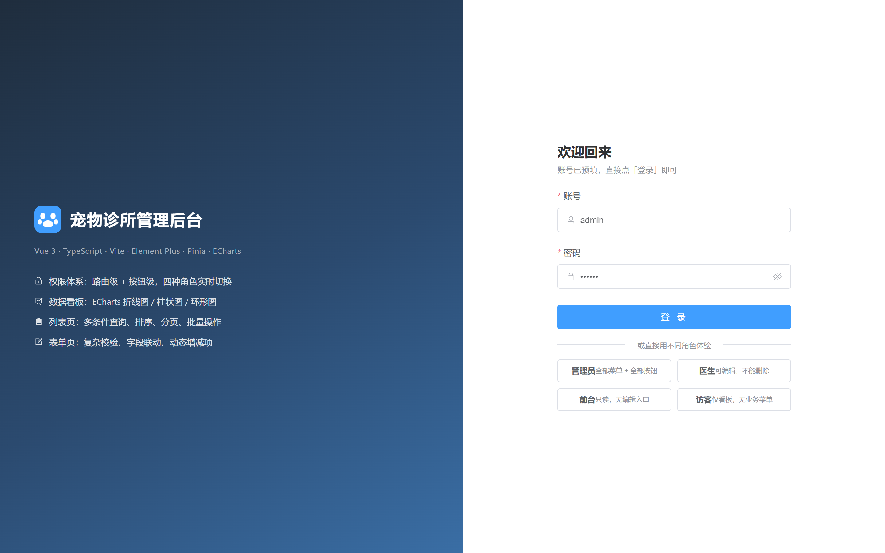
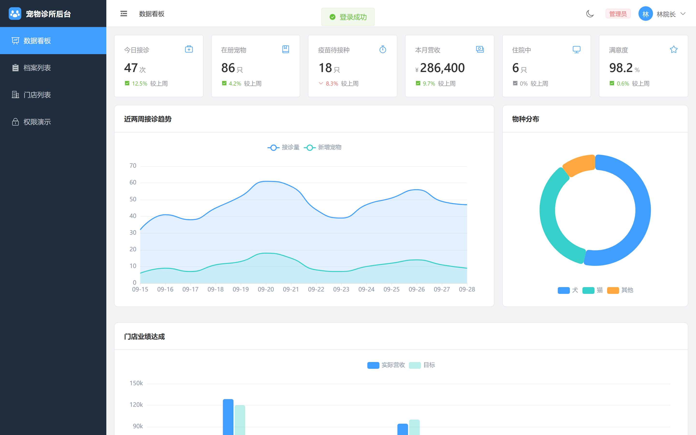
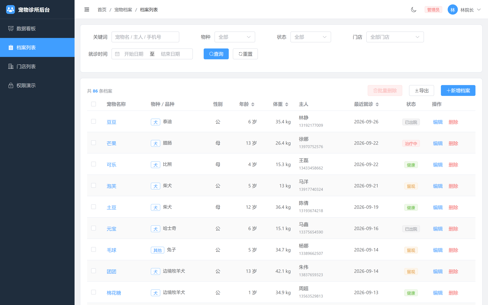
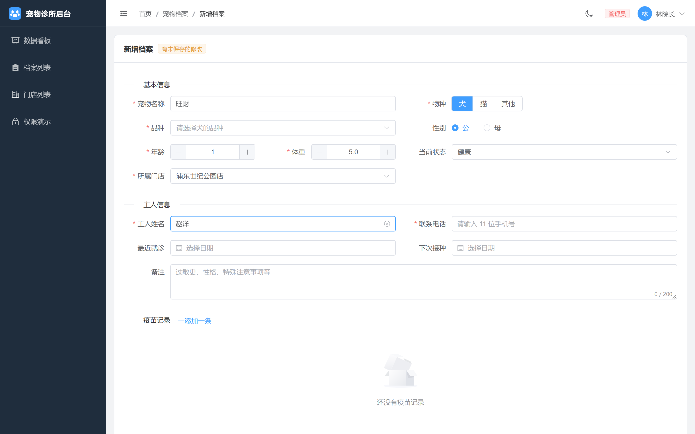
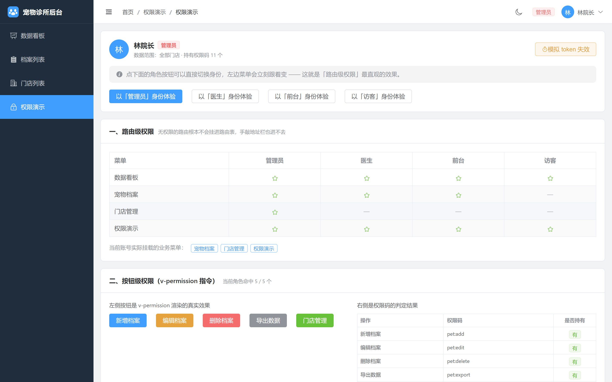
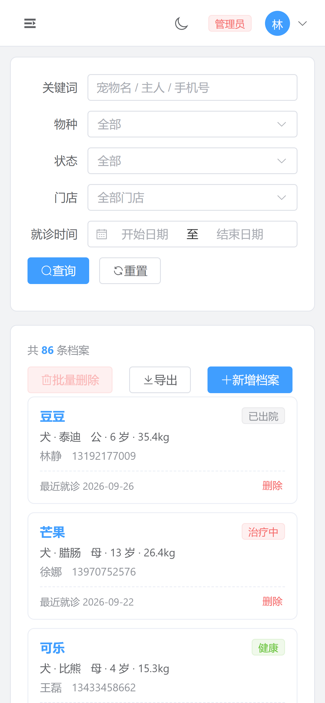
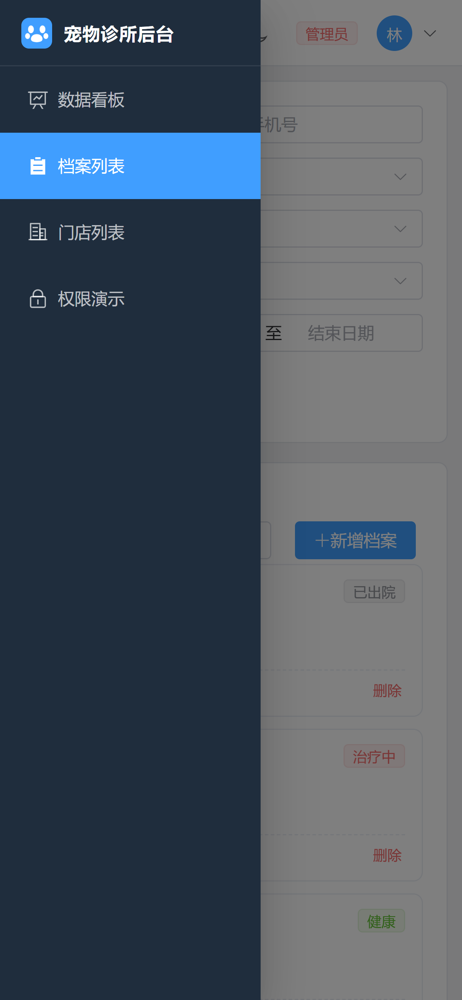

# 宠物诊所管理后台

一个连锁宠物诊所的后台管理系统 Demo。用 Vue 3 + TypeScript 从零搭起来，重点演示**路由级 + 按钮级 + 数据级三层权限体系**，以及列表、表单、图表这些后台最常见的页面形态该怎么写。

所有数据都是本地 mock 生成的假数据，不依赖任何后端，打开就能跑。

## 在线预览

**<https://pet-clinic-admin.ljf-dev.com>**

备用入口：<https://pet-clinic-admin.netlify.app>（同一站点，自定义域名万一解析异常时可用）

托管在 Netlify，推送到 `main` 分支会自动构建部署。

**演示账号**（登录页已预填，直接点「登录」即可；也可以点下面的一键体验按钮直接切角色）：

| 角色 | 账号 | 密码 | 能看到什么 |
|---|---|---|---|
| 管理员 | `admin` | `123456` | 全部菜单 + 全部按钮 + 全部门店数据 |
| 医生 | `doctor` | `123456` | 可新增/编辑，**不能删除**、不能导出 |
| 前台 | `receptionist` | `123456` | 只读，列表里没有编辑/删除入口，且只能看自己门店 |
| 访客 | `guest` | `123456` | 只有数据看板，业务菜单完全不挂载 |

想快速感受权限体系，直接点登录页的「以『前台』身份体验」，然后对比侧边栏菜单和列表页按钮的变化。

## 技术栈

Vue 3.5（Composition API + `<script setup>`）/ TypeScript 5.9 / Vite 8 / Element Plus 2.14 / Pinia 4 / Vue Router 5 / ECharts 6 / axios

## 功能

- **登录鉴权**：表单校验、token 持久化、路由守卫、401 统一拦截
- **数据看板**：6 个统计卡片 + 折线图 / 环形图 / 柱状图，窗口缩放自适应
- **列表页**：多条件查询、服务端排序、分页、批量删除、CSV 导出、loading 与空态
- **表单页**：新增/编辑复用同一组件、字段联动、动态增减项、跨字段校验、未保存离开提醒
- **权限体系**：路由级 + 按钮级 + 数据级，四种角色可实时切换
- **其他**：暗色主题、移动端适配、404 兜底

## 项目难点

挑几个不是「调 API 就完事」的地方，写一下遇到的问题和怎么解的。

### 1. Mock 数据要在生产环境也能跑

**问题**：作品集部署到静态托管后是没有后端的。常见方案 `vite-plugin-mock` 只在 dev server 生效，构建产物里的接口请求会直接 404 —— 招聘方点开链接看到的是一片空白，作品集等于废了。

**做法**：写了一个 axios 自定义 adapter，把请求直接路由到本地的 mock 分发器，不走网络层：

```ts
const mockAdapter: AxiosAdapter = async (config) => {
  const result = await dispatchMock({ url, method, params, data, token })
  const response = { data: result.body, status: result.status, /* ... */ }
  if (result.status >= 200 && result.status < 300) return response
  throw new AxiosError(result.body.message, String(result.status), config, undefined, response)
}
```

mock 层跟着打包进产物，静态托管照跑不误。顺便还模拟了 180–480ms 的网络延迟，loading 状态才是真的在转，而不是一闪而过。

### 2. 动态路由刷新后 404

**问题**：按角色 `addRoute()` 挂载菜单，登录时一切正常；但页面一刷新，Pinia 是空的、路由表也是空的，当前地址匹配不到任何路由。

**做法**：守卫里识别「有 token 但没有用户信息」这个状态，重新拉取用户信息并重建路由，然后返回一个重定向让导航**再跑一遍**：

```ts
accessible.forEach((route) => router.addRoute(route))
if (!router.hasRoute('CatchAll')) router.addRoute(catchAllRoute)
// 动态路由是刚刚才挂上去的，本次导航用的还是旧路由表，必须重跑一次才能匹配到
return { path: to.path, query: to.query, hash: to.hash, replace: true }
```

这里还有个容易踩的坑：兜底路由 `/:pathMatch(.*)*` 必须等动态路由**全部挂完**再加，否则它会抢先匹配掉 `/pet` 这类路径。

### 3. 按钮级权限：CSS 隐藏不算权限

**问题**：用 `v-if` 或 `display: none` 藏按钮只是「看不见」，DOM 里还在，改个样式或者翻一下内存就能点。

**做法**：`v-permission` 指令直接把元素从 DOM 上摘掉：

```ts
el.parentNode?.removeChild(el)
```

同时 mock 层对每个接口校验权限码，无权限返回 403 —— **前端藏 + 后端拦**，两层都要有。Demo 里可以用「前台」角色去调删除接口验证这一点。

### 4. 数据级权限：门店隔离

除了「能不能进这个页面」「能不能点这个按钮」，还有一层是「能看到哪些数据」。管理员看全部门店，其他角色只看自己门店的。这层过滤做在 mock 层，按当前登录用户过滤，前端传什么参数都绕不过去：

```ts
if (user?.clinicId) rows = rows.filter((p) => p.clinicId === user.clinicId)
```

### 5. 移动端上表格没法看

**问题**：1440px 宽的表格塞进 390px 的手机，列全挤成一团，横向滚动条还把卡片撑破了。

**做法**：窄屏下整个换掉展示形态，而不是硬压缩 —— 表格换成卡片流，侧边栏收进抽屉（点完菜单自动收起），查询表单从行内排布改成一列。分页组件也换成精简版式。

这块是**截图看不出来、只有真机/真视口才暴露**的问题，最后是靠 Playwright 切到 390×844 逐个页面量 `scrollWidth` 才确认没有横向溢出的。

### 6. 踩过的坑：504 Outdated Optimize Dep

**问题**：开发时进入某个页面突然白屏，控制台报 `504 Outdated Optimize Dep`。

**原因**：`unplugin-vue-components` 的按需引入会自动为每个组件注入样式导入，而 `main.ts` 里又整包引入了一份 Element Plus 的 CSS。Vite 在首次进入新页面时才发现这批新的样式依赖，触发依赖重新预构建，把正在进行中的请求打断了。

**做法**：`ElementPlusResolver({ importStyle: false })` 关掉按需样式，样式统一在 `main.ts` 引入一次。

### 7. 表单页的几个细节

- 新增和编辑**复用同一个组件**，靠路由是 `create` 还是 `:id/edit` 决定模式，不用维护两份几乎一样的代码
- 字段联动：物种一改，品种下拉的选项和已选值都要跟着变（不清空的话会留下「猫 + 金毛」这种脏数据）
- 跨字段校验：下次疫苗日期不能早于最近就诊日期，最近就诊日期不能是未来
- 疫苗记录可以动态增减，校验规则跟着索引走
- 有未保存修改时离开页面会二次确认

### 8. CSV 导出中文乱码

Excel 默认按 GBK 解析 CSV，导出的中文全是乱码。在内容最前面加一个 UTF-8 BOM（``）就好：

```ts
const blob = new Blob([`${csv}`], { type: 'text/csv;charset=utf-8' })
```

## 本地运行

```bash
npm install
npm run dev      # http://localhost:5173
```

其他命令：

```bash
npm run type-check   # vue-tsc 类型检查
npm run build        # 类型检查 + 生产构建
npm run preview      # 本地预览构建产物
```

> 需要 Node 20.19+ 或 22.12+（Vite 8 的要求）。

## 目录结构

```
src/
├── api/           接口封装 + axios 拦截器 + mock adapter
├── components/    AppIcon、BaseChart（ECharts 封装）
├── composables/   useTable（列表查询/分页/排序）、useMediaQuery、useAuthActions
├── constants/     下拉选项、中文标签、演示账号集中管理
├── directives/    v-permission 权限指令
├── layout/        侧边栏 + 顶栏 + 面包屑（窄屏自动切抽屉）
├── mock/          mock 数据 + 路由分发 + 权限校验
├── router/        路由表 + 权限守卫
├── stores/        Pinia：user、permission、app
├── styles/        全局样式与 CSS 变量
└── views/         login / dashboard / pet / clinic / permission / profile / 404
```

## 截图

| 登录页 | 数据看板 |
|---|---|
|  |  |

| 档案列表 | 新增档案表单 |
|---|---|
|  |  |

**权限演示**（这份 Demo 的重点）：



**移动端适配**：

| 卡片流列表 | 抽屉式菜单 |
|---|---|
|  |  |

## 说明

- 项目中的宠物档案、门店、员工等**全部为程序生成的虚构数据**，与任何真实机构无关
- 前端权限只负责展示层，真实项目里权限码应当由后端下发并在后端做最终拦截，这里的 mock 层只是把这个约定演示出来
